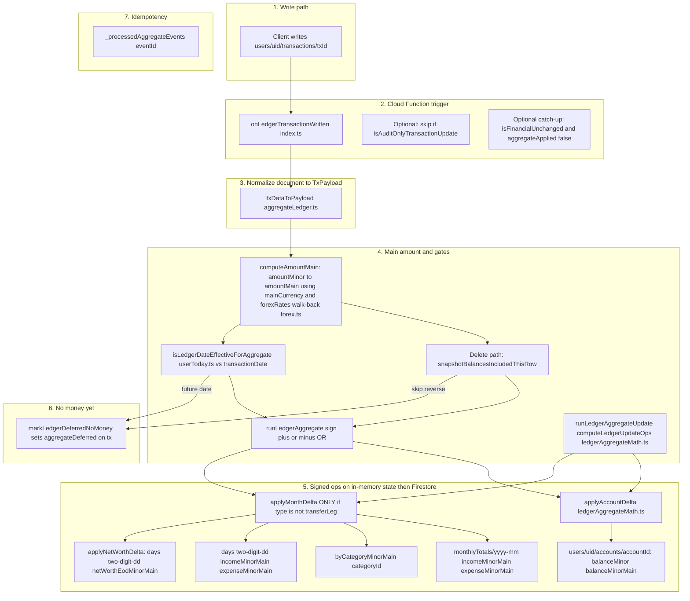

# Ledger aggregations and UI flow

**Purpose:** This file is the **canonical reference** for how a **`transactions`** write becomes **numbers on screen**: which **functions** run, **what math** they apply, and **which automated tests** must stay green when debugging drift.

**Rules we enforce:**

1. **Server-side** money math lives in **`functions/src/`** (especially [`ledgerAggregateMath.ts`](../functions/src/ledgerAggregateMath.ts)). Every primitive listed in §4 has a **Jest** test under [`functions/test/`](../functions/test/).
2. **Client-side** display math that adjusts Firestore fields (MTD, category scaling, sparkline fill) lives in **`lib/`** and must have a **Dart** test under [`test/`](../test/) (see §6).
3. **Propagation:** Jest scenarios assert **create → state**, **delete → reversal**, and **update → −before/+after** for accounts and `monthlyTotals` (see [`ledgerScenarios.test.ts`](../functions/test/ledgerScenarios.test.ts)). When you add a new **derived** UI number, add or extend tests in the same tier (Functions vs Flutter).

Complements [`data-model.md`](data-model.md) (schema) and [`data-contract.md`](data-contract.md) (streams).

---

## 1. Functional pipeline: from `transactions` to every aggregate field

This chart is **functional** (what gets written and how), not architectural.

**`transferLeg`:** Steps **5** still run **`applyAccountDelta`** for each leg’s `accountId`. **`applyMonthDelta` is skipped** for `transferLeg`, so **`monthlyTotals`** cashflow and **`byCategoryMinorMain`** do not change for those rows.

**Updates:** `runLedgerAggregateUpdate` uses **`computeLedgerUpdateOps`**: optionally **−before** (`sign -1`, `beforeMain`) and optionally **+after** (`sign +1`, `afterMain`). Same delta functions as create/delete.

---

## 2. Functional pipeline: Firestore aggregates → dashboard UI numbers

[`dashboard_screen.dart`](../lib/features/dashboard/presentation/dashboard_screen.dart) — mapping from **stream** → **formula** → **widget**.

```mermaid
flowchart TB
  subgraph streams["Firestore snapshots via Riverpod"]
    PA["accountsStreamProvider"]
    PM["monthlyTotalsForMonthStreamProvider dashboardYearMonth"]
    PT["todayYyyyMmDdProvider profile calendar"]
    PS["netWorthSparklineSeriesProvider reads monthlyTotals days netWorthEodMinorMain"]
    PR["recentTransactionsStreamProvider raw tx docs"]
    PU["dashboardUpcomingStripProvider upcoming plus rules not ledger aggregate"]
  end

  subgraph nwCard["Net worth metric"]
    NW1["If sparkline has any non-zero point"]
    NW1 --> NW2["Display sparkline.last as integer minor main"]
    NW3["Else sum over accounts"]
    NW3 --> NW4["_netWorthFromAccountsMinor: sum balanceMinorMain or balanceMinor"]
  end

  subgraph expCard["Monthly expense metric"]
    EX1["expenseMinorMainThroughDate m todayKey monthly_totals_as_of_date.dart"]
    EX1 --> EX2["Sum days dd expenseMinorMain for dd less or equal today day in same month doc"]
  end

  subgraph cash["Accounts accordion"]
    NC["_netCashMinor: sum balance for includeInNetCash"]
    AC["Per row: balanceMinorMain or balanceMinor"]
  end

  subgraph budget["Budget teaser"]
    BT["_totalExpenseBudgetMinor: sum budget targets kind expense"]
    SP["spent equals expenseMinorMainThroughDate"]
    LF["left equals budgetTotal minus spent clamped"]
    RG["_topCategoryRings: byCategoryMinorMainThroughDate then sort"]
  end

  subgraph recent["Recent transactions"]
    RV["Amounts from LedgerTransaction fields not monthlyTotals"]
  end

  PA --> NW3
  PA --> NC
  PA --> AC
  PM --> EX1
  PM --> BT
  PM --> SP
  PT --> EX1
  PT --> RG
  PS --> NW1
  PR --> RV
```

**Net worth chart:** `netWorthSparklineSeriesProvider` ([`finko_stream_providers.dart`](../lib/core/data/providers/finko_stream_providers.dart)) walks **30 calendar days** ending at **`todayYyyyMmDd`**, reads **`monthlyTotals.days[dd].netWorthEodMinorMain`**, **forward-fills** missing days from the last known value in-window (or `0`).

---

## 3. Traceability: calculation → implementation → test

### 3.1 Cloud Functions (authoritative aggregates)

| Calculation | Function(s) | Writes to | Jest coverage |
|-------------|-------------|-----------|----------------|
| Coerce Firestore tx → payload | `txDataToPayload` | — | [`aggregateLedger.guards.test.ts`](../functions/test/aggregateLedger.guards.test.ts) |
| Include row in delete reversal? | `snapshotBalancesIncludedThisRow` | — | [`aggregateLedger.guards.test.ts`](../functions/test/aggregateLedger.guards.test.ts) |
| Financial equality / audit-only | `isFinancialUnchanged`, `isAuditOnlyTransactionUpdate` | — | [`aggregateLedger.guards.test.ts`](../functions/test/aggregateLedger.guards.test.ts) |
| Posting date ≤ user today? | `isLedgerDateEffectiveForAggregate` | Gates `runLedgerAggregate` | [`userToday.test.ts`](../functions/test/userToday.test.ts) |
| FX hub conversions | `foreignMinorToMainMinor`, `convertMinorBetweenUsdMxnEur` | Used inside `computeAmountMain` | [`forex.test.ts`](../functions/test/forex.test.ts) |
| Update op list −before/+after | `computeLedgerUpdateOps` | — | [`ledgerAggregateMath.test.ts`](../functions/test/ledgerAggregateMath.test.ts) |
| Account balance delta | `applyAccountDelta` | `accounts` | [`ledgerAggregateMath.test.ts`](../functions/test/ledgerAggregateMath.test.ts), [`ledgerScenarios.test.ts`](../functions/test/ledgerScenarios.test.ts) |
| Month / category / day / NW delta | `applyMonthDelta`, `applyNetWorthDelta` | `monthlyTotals` | [`ledgerAggregateMath.test.ts`](../functions/test/ledgerAggregateMath.test.ts), [`ledgerScenarios.test.ts`](../functions/test/ledgerScenarios.test.ts) |
| Materialize schedule dates (related) | `computeNextTransactionDate`, `resolveAsOfYmd` | Not ledger aggregate | [`scheduleNext.test.ts`](../functions/test/scheduleNext.test.ts) |

**Propagation scenarios (Jest):** [`ledgerScenarios.test.ts`](../functions/test/ledgerScenarios.test.ts) — past expense applies to account + month + category + day; **full reversal**; **transfer legs** move two accounts only; **cross-month update** after prior apply; **past→future** update removes month/account effect; **salary inflow**. [`ledgerAggregateMath.test.ts`](../functions/test/ledgerAggregateMath.test.ts) covers **computeLedgerUpdateOps** edge cases.

**Not covered by Jest (requires emulator or Admin integration tests):** `runAggregateOpsTransaction` Firestore batching, `computeAmountMain` against real `forexRates` docs, `onLedgerTransactionWritten` dispatch ordering. The **numeric** behavior is still the same **`ledgerAggregateMath`** primitives above.

---

### 3.2 Flutter (display-only transforms)

| UI output | Formula / function | Inputs from Firestore | Test |
|-----------|---------------------|------------------------|------|
| MTD expense card | `expenseMinorMainThroughDate` | `monthlyTotals.days.*.expenseMinorMain`, `expenseMinorMain` | [`test/core/monthly_totals_as_of_date_test.dart`](../test/core/monthly_totals_as_of_date_test.dart) |
| Category ring scaling | `byCategoryMinorMainThroughDate` | `expenseMinorMain`, `byCategoryMinorMain`, `days` | [`test/core/monthly_totals_as_of_date_test.dart`](../test/core/monthly_totals_as_of_date_test.dart) |
| Net worth headline when sparkline empty | Sum `balanceMinorMain ?? balanceMinor` | `accounts` | *Widget/integration optional; logic is trivial sum* |
| Net cash line | Sum balances where `includeInNetCash` | `accounts` | *Same* |
| Sparkline 30 points | `netWorthSparklineSeriesProvider` | `monthlyTotals.days.*.netWorthEodMinorMain` | *Add `test/core/net_worth_sparkline_test.dart` if you want strict coverage* |
| Recent row amounts | Format `LedgerTransaction` | `transactions` | Canonical **per-tx** amounts, not `monthlyTotals` |

---

## 4. Formula reference (server): single signed operation

For one **`AggregateOp`** with `tx`, `sign` ∈ `{+1, −1}`, **`amountMain`** in user **main currency minor units**:

**Account** (`applyAccountDelta`):

- `dirSign = 1` if `direction === "in"`, else `−1`.
- `balanceMinor += sign * dirSign * amountMinor`
- `balanceMinorMain += sign * dirSign * amountMain`

**Month doc** (skip entirely if `type === "transferLeg"`):

- Month totals: add `sign * amountMain` to **`incomeMinorMain`** or **`expenseMinorMain`** according to direction.
- **Category:** if `categoryId` set: `byCategory[cat] += sign * amountMain` for **in**, `− sign * amountMain` for **out**.
- **Day:** same increment to **`days[dd].incomeMinorMain`** / **`expenseMinorMain`** where **`dd`** is `transactionDate` day-of-month two-digit string.
- **Net worth EOD:** delta on `days[dd].netWorthEodMinorMain` is `sign * amountMain` for **in**, `− sign * amountMain` for **out**, then **`applyNetWorthDelta`** propagates to later days in the month that already had NW points.

Full code: [`ledgerAggregateMath.ts`](../functions/src/ledgerAggregateMath.ts). Orchestration and FX: [`aggregateLedger.ts`](../functions/src/aggregateLedger.ts).

---

## 5. Deferred and reconcile

If **`transactionDate`** is **after** profile **today**, aggregates above are **not** applied; **`aggregateDeferred`** may be set. Callable **`reconcileDeferredLedgerForUser`** re-runs **`runLedgerAggregate(..., +1, ...)`** when the date becomes effective — see [`reconcileDeferredLedgerCore.ts`](../functions/src/reconcileDeferredLedgerCore.ts).

---

## 6. Roles recap

| Layer | Responsibility |
|-------|----------------|
| **`transactions`** | Canonical ledger rows. |
| **Cloud Functions** | Incremental **`accounts`** + **`monthlyTotals`**; **`amountMain`** via FX. |
| **Flutter** | **No** full re-sum of dashboard totals from raw `transactions`; uses **`accounts`** + **`monthlyTotals`** + small **MTD/sparkline** helpers in §3.2. |

---

## 7. Revision log

| Date | Change |
|------|--------|
| 2026-04-16 | Functional flowcharts (CF + dashboard), traceability tables, Jest/Dart test mapping, propagation rules; Dart tests for MTD helpers. |
| 2026-04-16 | Initial doc: CF math, gates, transfers, deferred reconcile, Flutter providers and MTD/sparkline client derivations. |
